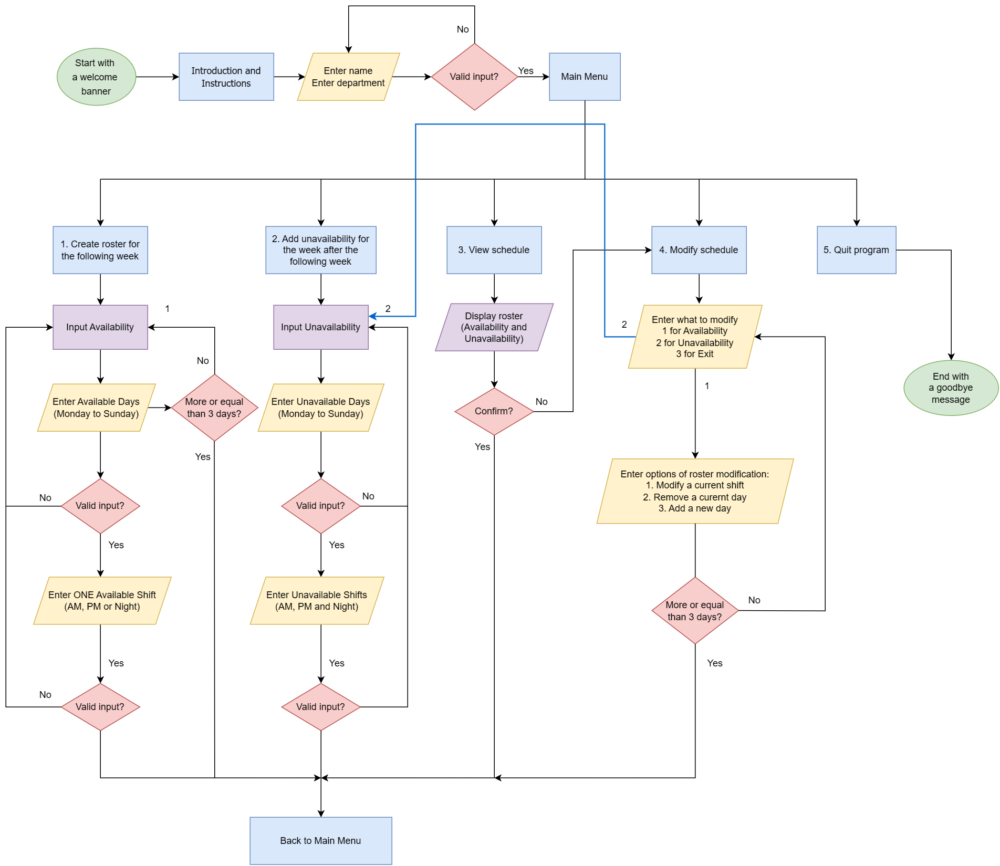

# **My Pham - T1A3 - Terminal Application**

# References

# Links
1. GitHub repository:
2. Presentation:
3. Project management plan:

# Code style guide and styling conventions

1. Rossum, G., Warsaw, B., Coghlan, N. (2001) PEP8 - Style Guide for Python Code [Styling Convention]. https://peps.python.org/pep-0008/

2. Goodger, D., Rossum, G. (2001) PEP 257 - Docstring Conventions [Styling Convention]. https://peps.python.org/pep-0257/

3. https://peps.python.org/pep-0405/#specification

# Functionalities

## Description

NKG Corp. is a warehousing and distribution company. They have a large number of staff working across rotating shifts. **RosterBoard** is an internal application that allows company staff to provide their availability and unavailability, which are used for roster building and workforce planning. 

## Main features
1. Users (the company staff) are asked to provide their name and their department before starting their work schedule. If all answers are valid, they get prompted to the Home Menu. 
2. The Home Menu has FIVE prompts : Create Roster, Add Future Unavailability, View Roster, Modify Roster and Exit Program. 
3. In the Create Roster Function, users are requested to create their roster for the following week based on a list of questions:
    - Select available days for the following week (Monday to Sunday).
    - Select available shift for the each chosen available day.

    There are some criteria when creating the roster. First, if available days are less than THREE days, users are required to select more days, if not, they have no roster for the following week and get prompted back to Home Menu. Second, users can only choose ONE shift per available day. 

4. In the Add Future Unavailability Function, users are requested to select their unavailable days for the ONE week after the following week. Here they can input as many days or shifts as they wish. If they have no unavailability, there will be no record.  

5. In the View Roster Function, users' final work schedule is displayed. Users can confirm this work schedule or if they change their mind, they can have option to modify the current schedule. Note that once users finish providing their availability and unavailability in the last two functions, they can not go back and restart the procedure. They can only modify the schedule records by using Modify Roster Function. 

6. In the Modify Roster Function, users have two options.

    - Modify the current roster: options include changing shift, removing a current day or adding a new day. 
    - Modify unavailability: users will have to redo their unavailability from the scratch if they do not wish to keep their current record. 

## Control Flow Diagram

The below diagram illustrates how the flow of data and the application's logic. 

(Diagram created using diagram.net.io)

 

# Implementation Plan

## Overall implementation process

1. The project management plan is outlined with the kanban board format using Trello.

2. Created a control flow diagram to visualize the flow of data in the app. The diagram was slightly modified along the way due to little compromised changes in the development process. 

3. Created a mock output using notepad to help visualizing the expected output when the app is run successfully and without errors. 

4. Start writing the source code.

5. Errors were handled along the way during the coding process.

6. Develop a testing plan, including manual tests and tests using `pytest`.

7. Write scripts for app execution and develop help documentation. 

8. Readme file was updated along the way whenever a task was finished.  

9. Summarise the project with slide deck and presentation 

 

## The development of each feature and timeline

The task priority are listed as below:

1. Define classes and common functions. 
2. Functions to get users' information
3. `create_roster` function
4. `add_unavailability` function
5. `view_schedule` function 
6. `modify_schedule` function
7. Error handling and testing
8. Installation scripts

 

**Files arrangement**

- **main.py** is the main file which stores simple functions like `input_name()`, `department_choice()` and `main_menu()`

- **Roster.py**, **Unavailability.py** and **Item.py** are the files that store code for classes, the functions within these classes get imported in different files when needed. 

- **common_functions.py** is the file which store all common functions that are used accross files.

- **create_roster_function.py** is the file which contains `create_roster` function, it gets imported in **main.py** as Prompt 1.

- **add_unavailability_function.py** is the file which contains `add_unavailability` function, it gets imported in **main.py** as Prompt 2.

- **view_roster_function.py** is the file which contains `view_schedule` function, it gets imported in **main.py** as Prompt 3.

- **modify_roster_function.py** is the file which contains `modify_schedule` function, it gets imported in **main.py** as Prompt 4.

 

**Classes and common functions**

1. The class named `Roster` is used to represents a roster object, it contains a few functions that belong to the relevant roster object. The functions within this class are listed as below:
    - `load_from_file()`: this function is used to load data from a csv file to a temporary list for easy manipulation on memory. 
    - `save_to_csv()`: this function is called to save the data to csv file for final display when the above list of data are met with all criteria.
    - `display_roster()`: this function is called when the list of data need to be displayed.
   
2. The class named `Unavailability` was created with the same approach as `Roster`, it is used to represents an unavailability object. It has the same functions, which are `load_from_file()`, `save_to_csv()` and `display_unavailability()`. 

3. The class named `Item` is used to represents an item object. Here the item means each available day or unavailable day in the csv files, the parameters in an item object including day, shift and action (or status). 

4. `common_functions.py` file is used to store all functions that are used across files in source code, including functions for text color and `check_valid_shift()` function to check valid input for shifts. 

 

**Getting users' information**

This code section includes getting users' input for their name and their department. 

<table>
    <thead>
        <tr>
            <th>Checklist</th>
            <th>Tasks</th>
            <th>Timeline</th>
        </tr>
    </thead>
    <tbody>
        <tr>
            <td>1</th>
            <td>A function to return users' name</th>
            <td>25-26 Apr</th>
        </tr>
        <tr>
            <td>2</th>
            <td>Error handling: name input must be all letters, using `re` module</th>
            <td>25-26 Apr</th>
        </tr>
        <tr>
            <td>3</th>
            <td>A function to return users's department</th>
            <td>25-26 Apr</th>
        </tr>
        <tr>
            <td>4</th>
            <td>Error handling: department selection must be in the given list, using `try` `except`</th>
            <td>25-26 Apr</th>
        </tr>
        <tr>
            <td>5</th>
            <td>A greeter is displayed once users finish registering, followed by the Home Menu</th>
            <td>25-26 Apr</th>
        </tr>
        </tr>
        <tr>
            <td>6</th>
            <td>Home Menu is displayed with FIVE main prompts</th>
            <td>25-26 Apr</th>
        </tr>
    </tbody>
</table>

**Day 1**: Create project management plan, design control flow diagram, create mocking output, create welcome banner, introduction and instructions, research on `datetime` module, start on functions to get users' information.

 

**`create_roster` function**

This section allows users to choose their available days during the following week. Users are required to choose more than THREE days of work and only ONE shift per day. Their inputs will be used to form their roster.

<table>
    <thead>
        <tr>
            <th>Checklist</th>
            <th>Items</th>
            <th>Timeline</th>
        </tr>
    </thead>
    <tbody>
        <tr>
            <td>1</th>
            <td>A function that always returns dates for Mon to Sun of the following week using `weekday()`</th>
            <td>26-28 Apr</th>
        </tr>
        <tr>
            <td>2</th>
            <td>User's chosen days get recorded in csv file using `csv.writer`</th>
            <td>26-28 Apr</th>
        </tr>
        <tr>
            <td>3</th>
            <td>Checking list of input to make sure a chosen day can not be selected again </th>
            <td>26-28 Apr</th>
        </tr>
        <tr>
            <td>4</th>
            <td>Use `while` to looping users to keep selecting days until they hit Q to end</th>
            <td>26-28 Apr</th>
        </tr>
        <tr>
            <td>5</th>
            <td>Using `csv.reader` and using `len()` to count if users select less than 3 days. If yes, prompt to add more days. If not, users have no roster, clear all input in csv file using `csv.writer`</th>
            <td>26-28 Apr</th>
        </tr>
        <tr>
            <td>6</th>
            <td>A function to check valid shift input and make sure only ONE shift is selected</th>
            <td>26-28 Apr</th>
        </tr>
        <tr>
            <td>7</th>
            <td>Using `len()` to check existed record in csv file. If existed, prompt users to Modify Roster Function if they need to make changes</th>
            <td>26-28 Apr</th>
        </tr>
    </tbody>
</table>

**Day 2**: Complete functions for getting users' information, start working on Create Roster Function, research on OOP, research on file handling and `csv` module, research on `RegEx`.

 

**Day 3**: Complete Create Roster Function and start reporting on Readme file, start working on Add Future Unavailability Function. 

 

**`add_unavailability` function**

This section allows users to choose their unavailable days during week after the following week. Users can choose as many days and shifts as they wish and they all get record as their unavailability request.

<table>
    <thead>
        <tr>
            <th>Checklist</th>
            <th>Items</th>
            <th>Timeline</th>
        </tr>
    </thead>
    <tbody>
        <tr>
            <td>1</th>
            <td>Unavailability records are stored in a separate CSV file </th>
            <td>28-29 Apr</th>
        </tr>
        <tr>
            <td>2</th>
            <td>Users can not select two same days but can select more than one shift, using `list.append()` to allow multiple shifts </th>
            <td>28-29 Apr</th>
        </tr>
        <tr>
            <td>3</th>
            <td>Chosen shifts are stored in `set()` to eliminate duplication </th>
            <td>28-29 Apr</th>
        </tr>
        <tr>
            <td>4</th>
            <td>If users accidently select a day but no shift is chose. The chosen day will not be counted as their unavailable day, using `len()` to check set items</th>
            <td>28-29 Apr</th>
        </tr>
        <tr>
            <td>5</th>
            <td>Error handling for all users' input using `while` loop and `if` `elif` `else`</th>
            <td>28-29 Apr</th>
        </tr>
        <tr>
            <td>6</th>
            <td>Using `len()` to check existed record in csv file. If existed, prompt users to Modify Roster Function if they need to make changes</th>
            <td>28-29 Apr</th>
        </tr>
    </tbody>
</table>

 

**`view_schedule` function**

This section allows users to view their work schedule which has been recorded from their previous inputs. Their final work schedule includes users' name, department, action date, followed by their rostered days and unavailability records.

<table>
    <thead>
        <tr>
            <th>Checklist</th>
            <th>Items</th>
            <th>Timeline</th>
        </tr>
    </thead>
    <tbody>
        <tr>
            <td>1</th>
            <td>Users' name, department and action date are displayed by importing from `main.py` </th>
            <td>29 Apr</th>
        </tr>
        <tr>
            <td>2</th>
            <td>Users' input for availability and unavailability are arranged in a table format using `prettytable`</th>
            <td>29 Apr</th>
        </tr>
        <tr>
            <td>3</th>
            <td>A prompt to request users to confirm their current work schedule</th>
            <td>29 Apr</th>
        </tr>
        <tr>
            <td>4</th>
            <td>If users do not confirm, they are prompted back to Home Menu and choose Modify Roster Function</th>
            <td>29 Apr</th>
        </tr>
        <tr>
            <td>5</th>
            <td>Error handling for users' input using `while` loop and `if` `elif` `else`</th>
            <td>29 Apr</th>
        </tr>
    </tbody>
</table>

**Day 4**: Complete Add Future Unavailability Function and View Roster Function

 

**`modify_schedule` function**

This section allows user to modify their current roster or modify their current unavailability records. 
1. Modify current roster: Here users have options to modify the shift of a current rostered day, to remove a current rostered day or to add a new day to the roster. 

2. Modify current unavailability records: the initial idea is to allow users manipulate the records in the same way as above. Later on, I decided to simplify it by prompting users to redo their unavailability from the scratch.

<table>
    <thead>
        <tr>
            <th>Checklist</th>
            <th>Items</th>
            <th>Timeline</th>
        </tr>
    </thead>
    <tbody>
        <tr>
            <td>1</th>
            <td>Prompt users to two options: 1/ Modify their current roster or 2/ Modify their unavailability record</th>
            <td>30 Apr - 02 May</th>
        </tr>
        <tr>
            <td>2</th>
            <td>User have three options on how they can manipulate their current roster: 1/to modify, 2/to remove and 3/to add</th>
            <td>30 Apr - 02 May</th>
        </tr>
        <tr>
            <td>3</th>
            <td>Requirement when adding a day: if the day is already existed --> have to choose another day.</th>
            <td>30 Apr - 02 May</th>
        </tr>
        <tr>
            <td>4</th>
            <td>Requirement when modifying or removing a day: if the day is not existed --> have to choose another day</th>
            <td>30 Apr - 02 May</th>
        </tr>
        <tr>
            <td>5</th>
            <td>Requirement when removing a day: re-check if there are less than THREE rostered days, using `csv.reader` and `len()` to read and count</th>
            <td>30 Apr - 02 May</th>
        </tr>
         <tr>
            <td>6</th>
            <td>Error handling for users input: inputs for any modified days need to be in a given format, using `strptime()`</th>
            <td>30 Apr - 02 May</th>
        </tr>
         <tr>
            <td>7</th>
            <td>A function for checking valid shifts input to reuse whenever users are required to input their shifts</th>
            <td>30 Apr - 02 May</th>
        </tr>
         <tr>
            <td>8</th>
            <td>Prompt users to redo their unavailability by importing `add_unavailability()` function</th>
            <td>30 Apr - 02 May</th>
        </tr>
    </tbody>
</table>

**Day 5 and Day 6**: Complete Modify Roster Function, research on `pytest` and  plan test cases, work on reporting documentation. 

**Day 7 and Day 8**: Review source code and optimize by applying OOP, redo some pieces of code that execute the same tasks, so that it can be reuse when needed.

 

# Installation

## Steps to install the app

1. Step 1:
    - Change the directory to a folder where you want to download the app using `cd <directory>`

    - Clone this repository using `git clone https://github.com/ellenpham/RosterBoard_app.git`

    - Change the directory to the src folder using `cd src`

2. In your computer, open terminal or command prompt:
    
    For Mac/Linux users

    - Execute Bash script `chmod +x run.sh`

    - Run the app `source run.sh`

    For Window users: 

    - Run the app with `run.cmd`

3. Dependencies

4. System prerequisites: 

    - Python Version 3 is required to run the application. If Python has not been installed in your computer, please download by following [this link](https://www.python.org/downloads/).

    - Setup Git

    - 

