# **My Pham - T1A3 - Terminal Application**

# Links
[GitHub repository](https://github.com/ellenpham/RosterBoard_app.git)

Presentation:

[Project management plan](https://trello.com/b/eYtq1Thk/t1a3-terminal-application)


# Code style guide and styling conventions

1. Rossum, G., Warsaw, B., Coghlan, N. (2001) PEP8 - Style Guide for Python Code [Styling Convention]. https://peps.python.org/pep-0008/

2. Goodger, D., Rossum, G. (2001) PEP 257 - Docstring Conventions [Styling Convention]. https://peps.python.org/pep-0257/


# Installation

## System prerequisites

- Python Version 3x is required to run the application. If Python has not been installed in your computer, please download by following [this link](https://www.python.org/downloads/).

- Git Setup is required to be able to clone the repo to your computer, follow [this link](https://git-scm.com/book/en/v2/Getting-Started-First-Time-Git-Setup) to set up Git. Alternatively, you can download zip file to your computer by going to my [GitHub repo](https://github.com/ellenpham/RosterBoard_app), click into **Code**, then **Download ZIP**. 

- For Window users, a latest version of Windows is required with WSL2/Ubuntu installed. If you have not had WSL2/Ubuntu set up, please follow [this link](https://learn.microsoft.com/en-us/windows/wsl/install).


## Installation steps

1. In your computer, open terminal or command prompt:

    - For Window users: Go to Start menu, in the search bar, search for Terminal app, type in `bash` then hit Enter

    - For Mac users: use Spotlight Search by clicking the search icon on the top right of the screen (or press Command+Space). In the search bar, type in "Terminal" and hit Return

2. In your computer, open terminal or command prompt:
    
    - Change the directory to a folder where you want to download the app using `cd <directory>`

    - Clone this repository using `git clone https://github.com/ellenpham/RosterBoard_app.git`

    - Change the directory to the src folder using `cd .\RosterBoard_app\src`

    - Execute Bash script `chmod +x run.sh`

    - Run the app `source run.sh`


## Dependencies

These modules will be automatically intalled when running the program. 

colored==1.4.4
exceptiongroup==1.1.1
iniconfig==2.0.0
packaging==23.1
pluggy==1.0.0
prettytable==3.7.0
pytest==7.3.1
tomli==2.0.1
wcwidth==0.2.6

## Command lines arguments

Instructions are included when running the application to help users perform each task. 

The below command lines are commonly used:

- Users' selection options are mainly formatted in a numbered list, corresponding numbers should be entered to be considered valid input. 

- Users are guided with option to quit by enter "Q" whenever each task is finished.

- Users only can completely exit the program when entering "Exit" at Home Menu.

- Follow guideline while running the app for the validity of other text-based input.

<br>

# Functionalities

## Description

NKG Corp. is a warehousing and distribution company. They have a large number of staff working across rotating shifts. **RosterBoard** is an internal application that allows company staff to provide their availability and unavailability, which are used for roster building and workforce planning. 


## Main features
1. Users (the company staff) are asked to provide their name and their department before starting their work schedule. If all answers are valid, they get prompted to the Home Menu. 
2. The Home Menu has FIVE prompts : Create Roster, Add Future Unavailability, View Roster, Modify Roster and Exit Program. 
3. In the Create Roster Function, users are requested to create their roster for the following week based on a list of questions:
    - Select available days for the following week (Monday to Sunday).
    - Select available shift for the each chosen available day.

    There are some criteria when creating the roster. First, if available days are less than THREE days, users are required to select more days, if not, they have no roster for the following week and get prompted back to Home Menu. Second, users can only choose ONE shift per available day. 

4. In the Add Future Unavailability Function, users are requested to select their unavailable days for the ONE week after the following week. Here they can input as many days or shifts as they wish. If they have no unavailability, there will be no record.  

5. In the View Roster Function, users' final work schedule is displayed. Users can confirm this work schedule or if they change their mind, they can have option to modify the current schedule. Note that once users finish providing their availability and unavailability in the last two functions, they can not go back and restart the procedure. They can only modify the schedule records by using Modify Roster Function. 

6. In the Modify Roster Function, users have two options.

    - Modify the current roster: options include changing shift, removing a current day or adding a new day. 
    - Modify unavailability: users will have to redo their unavailability from the scratch if they do not wish to keep their current record. 


## Control Flow Diagram

The below diagram illustrates how the flow of data and the application's logic. 


(Diagram created using diagram.net.io)

<br>

# Implementation Plan

## Overall implementation process

1. The project management plan was created using kanban board in Trello.

2. Created a control flow diagram to visualize the flow of data in the app. The diagram was slightly modified along the way due to little compromised changes in the development process. 

3. Created a mock output using notepad to help visualizing the expected output when the app is run successfully and without errors. 

4. Start writing the source code.

5. Errors were handled along the way during the coding process.

6. Develop a testing plan, including manual tests and tests using `pytest`.

7. Write scripts for app execution and develop help documentation. 

8. Readme file was updated along the way whenever a task was finished.  

9. Summarise the project with slide deck and presentation 

<br>

## The development of each feature and timeline

Below is the task priority during source code development process:

1. Define classes and common functions
2. Functions to get users' information
3. `create_roster` function
4. `add_unavailability` function
5. `view_schedule` function 
6. `modify_schedule` function
7. Error handling
8. Testing

<br>

**Files arrangement**

- **main.py** is the main file which stores simple functions like `input_name()`, `department_choice()` and `main_menu()`

- **Roster.py**, **Unavailability.py** and **Item.py** are the files that store code for classes, the functions within these classes get imported in different files when needed. 

- **common_functions.py** is the file which store all common functions that are used accross files.

- **create_roster_function.py** is the file which contains `create_roster` function, it gets imported in **main.py** as Prompt 1.

- **add_unavailability_function.py** is the file which contains `add_unavailability` function, it gets imported in **main.py** as Prompt 2.

- **view_roster_function.py** is the file which contains `view_schedule` function, it gets imported in **main.py** as Prompt 3.

- **modify_roster_function.py** is the file which contains `modify_schedule` function, it gets imported in **main.py** as Prompt 4.

<br>

**Classes and common functions**

1. The class named `Roster` represents a roster object, it contains a few functions that belong to the relevant roster object. The functions within this class are listed as below:
    - `load_from_file()`: this function is used to load data from a csv file to a temporary list for easy manipulation on memory. 
    - `save_to_csv()`: this function is called to save the data to csv file for final display when the above list of data are met with all criteria.
    - `display_roster()`: this function is called when the list of data need to be displayed.
   
2. The class named `Unavailability` was created with the same approach as `Roster`, it is used to represents an unavailability object. It has the same functions, which are `load_from_file()`, `save_to_csv()` and `display_unavailability()`. 

3. The class named `Item` is used to represents an item object. Here the item means each available day or unavailable day in the csv files, the parameters in an item object including day, shift and action (or status). 

4. `common_functions.py` file is used to store all functions that are used across files in source code, including functions for text color and `check_valid_shift()` function to check valid input for shifts. 

<br>

**Getting users' information**

This code section includes getting users' input for their name and their department. 

<table>
    <thead>
        <tr>
            <th>Checklist</th>
            <th>Tasks</th>
            <th>Timeline</th>
        </tr>
    </thead>
    <tbody>
        <tr>
            <td>1</th>
            <td>A function to return users' name</th>
            <td>25-26 Apr</th>
        </tr>
        <tr>
            <td>2</th>
            <td>Error handling: name input must be all letters, using RegEx </th>
            <td>25-26 Apr</th>
        </tr>
        <tr>
            <td>3</th>
            <td>A function to return users's department</th>
            <td>25-26 Apr</th>
        </tr>
        <tr>
            <td>4</th>
            <td>Exception handling: department selection must be in the given list, using try, except statement</th>
            <td>25-26 Apr</th>
        </tr>
        <tr>
            <td>5</th>
            <td>A greeter is displayed once users finish registering, followed by the Home Menu</th>
            <td>25-26 Apr</th>
        </tr>
        </tr>
        <tr>
            <td>6</th>
            <td>Home Menu is displayed with FIVE main prompts</th>
            <td>25-26 Apr</th>
        </tr>
    </tbody>
</table>

<br>

**Day 1**: Create project management plan, design control flow diagram, create mocking output, create welcome banner, introduction and instructions, research on `datetime` module, start on functions to get users' information.


<br>

**`create_roster` function**

This section allows users to choose their available days during the following week. Users are required to choose more than THREE days of work and only ONE shift per day. Their inputs will be used to form their roster.

<table>
    <thead>
        <tr>
            <th>Checklist</th>
            <th>Tasks</th>
            <th>Timeline</th>
        </tr>
    </thead>
    <tbody>
        <tr>
            <td>1</th>
            <td>A function that always returns dates for Mon to Sun of the following week using weekday()</th>
            <td>26-28 Apr</th>
        </tr>
        <tr>
            <td>2</th>
            <td>After being processed, list of chosen days is saved in csv file using csv.writer() for displaying final schedule (schedule_record.csv) </th>
            <td>26-28 Apr</th>
        </tr>
        <tr>
            <td>3</th>
            <td>Checking list of input to make sure a chosen day can not be selected again </th>
            <td>26-28 Apr</th>
        </tr>
        <tr>
            <td>4</th>
            <td>Use `while` to looping users to keep selecting days until they hit Q to end</th>
            <td>26-28 Apr</th>
        </tr>
        <tr>
            <td>5</th>
            <td>Using `csv.reader` and using `len()` to count if users select less than 3 days. If yes, prompt to add more days. If not, users have no roster, clear all input in csv file using `csv.writer`</th>
            <td>26-28 Apr</th>
        </tr>
        <tr>
            <td>6</th>
            <td>A function to check valid shift input and make sure only ONE shift is selected</th>
            <td>26-28 Apr</th>
        </tr>
        <tr>
            <td>7</th>
            <td>Using len() to check existed record in csv file. If existed, prompt users to Modify Roster Function if they need to make changes</th>
            <td>26-28 Apr</th>
        </tr>
    </tbody>
</table>

<br>

**Day 2**: Complete functions for getting users' information, start working on `create_roster` function, research on OOP, research on file handling and `csv` module, research on `RegEx`.


<br>

**`add_unavailability` function**

This section allows users to choose their unavailable days for the week after the following week. Users can choose as many days and shifts as they wish and they are all saved as their unavailability record.

<table>
    <thead>
        <tr>
            <th>Checklist</th>
            <th>Tasks</th>
            <th>Timeline</th>
        </tr>
    </thead>
    <tbody>
        <tr>
            <td>1</th>
            <td>List of unavailability record is saved in a separate CSV file (ua_record.csv) </th>
            <td>28-29 Apr</th>
        </tr>
        <tr>
            <td>2</th>
            <td>Users can not select two same days but can select more than one shift, using list.append() to allow multiple shifts added </th>
            <td>28-29 Apr</th>
        </tr>
        <tr>
            <td>3</th>
            <td>Chosen shifts are converted from a list to a set to eliminate duplication </th>
            <td>28-29 Apr</th>
        </tr>
        <tr>
            <td>4</th>
            <td>If users accidently select a day but no shift is chose. The chosen day will not be counted as their unavailable day, using len() to check set items</th>
            <td>28-29 Apr</th>
        </tr>
        <tr>
            <td>5</th>
            <td>Error handling for all users' input using while loop and if elif else</th>
            <td>28-29 Apr</th>
        </tr>
        <tr>
            <td>6</th>
            <td>Using len() to check existed record in csv file. If existed, prompt users to Modify Roster Function if they need to make changes</th>
            <td>28-29 Apr</th>
        </tr>
    </tbody>
</table>

<br>

**Day 3**: Complete `create_roster` function and start reporting on Readme file, start working on `add_unavailability` function. 


<br>

**`view_schedule` function**

This section allows users to view their work schedule which has been recorded from their previous inputs. Their final work schedule includes users' name, department, action date, followed by their rostered days and unavailability records.

<table>
    <thead>
        <tr>
            <th>Checklist</th>
            <th>Items</th>
            <th>Timeline</th>
        </tr>
    </thead>
    <tbody>
        <tr>
            <td>1</th>
            <td>Users' name, department and action date are displayed by importing from main.py file </th>
            <td>29 Apr</th>
        </tr>
        <tr>
            <td>2</th>
            <td>Users' input for availability and unavailability are arranged in a table format using Prettytable module</th>
            <td>29 Apr</th>
        </tr>
        <tr>
            <td>3</th>
            <td>A prompt to request users to confirm their current work schedule</th>
            <td>29 Apr</th>
        </tr>
        <tr>
            <td>4</th>
            <td>If users do not confirm, they are prompted back to Home Menu, where they can select Prompt 4 to modify the schedule</th>
            <td>29 Apr</th>
        </tr>
        <tr>
            <td>5</th>
            <td>Error handling for users' input using while loop and if elif else</th>
            <td>29 Apr</th>
        </tr>
    </tbody>
</table>

<br>

**Day 4**: Complete `add_unavailability` function and `view_schedule` function


<br>

**`modify_schedule` function**

This section allows user to modify their current roster or modify their current unavailability records. 
1. Modify current roster: Here users have options to modify the shift of a current rostered day, to remove a current rostered day or to add a new day to the roster. 

2. Modify current unavailability records: the initial idea is to allow users manipulate the records in the same way as above. Later on, I decided to simplify it by prompting users to redo their unavailability from the scratch.

<table>
    <thead>
        <tr>
            <th>Checklist</th>
            <th>Tasks</th>
            <th>Timeline</th>
        </tr>
    </thead>
    <tbody>
        <tr>
            <td>1</th>
            <td>Prompt users to two options: 1/ Modify their current roster or 2/ Modify their unavailability record</th>
            <td>30 Apr - 02 May</th>
        </tr>
        <tr>
            <td>2</th>
            <td>User have three options on how they can manipulate their current roster: 1/to modify or change current shift, 2/to remove and 3/to add</th>
            <td>30 Apr - 02 May</th>
        </tr>
        <tr>
            <td>3</th>
            <td>Requirement when adding a day: users can not add an existing day. Achieved by define boolean values for the existed_day variable </th>
            <td>30 Apr - 02 May</th>
        </tr>
        <tr>
            <td>4</th>
            <td>Requirement when modifying or removing a day: users can not select a day that is not existed. Achieved by define a dictionary for day items and checking the values</th>
            <td>30 Apr - 02 May</th>
        </tr>
        <tr>
            <td>5</th>
            <td>Requirement when removing a day: re-check if there are less than THREE rostered days, using csv.reader and len() to read and count</th>
            <td>30 Apr - 02 May</th>
        </tr>
         <tr>
            <td>6</th>
            <td>Error handling for users' input using while loop and if elif else</th>
            <td>30 Apr - 02 May</th>
        </tr>
         <tr>
            <td>7</th>
            <td>A function for checking valid shifts input to reuse whenever users are required to input their shifts</th>
            <td>30 Apr - 02 May</th>
        </tr>
         <tr>
            <td>8</th>
            <td>Prompt users to redo their unavailability by importing add_unavailability() function</th>
            <td>30 Apr - 02 May</th>
        </tr>
    </tbody>
</table>

<br>

**Day 5**: Working on Modify Roster Function, do more research on OOP and planning on optimizing the code. 


<br>

**Day 6 and Day 7**: Review source code and optimize by applying OOP, redo some pieces of code that execute the same tasks, so that it can be reused when needed. Also, data manipulation is more achievable by applying OOP. Write Bash script and help documentation

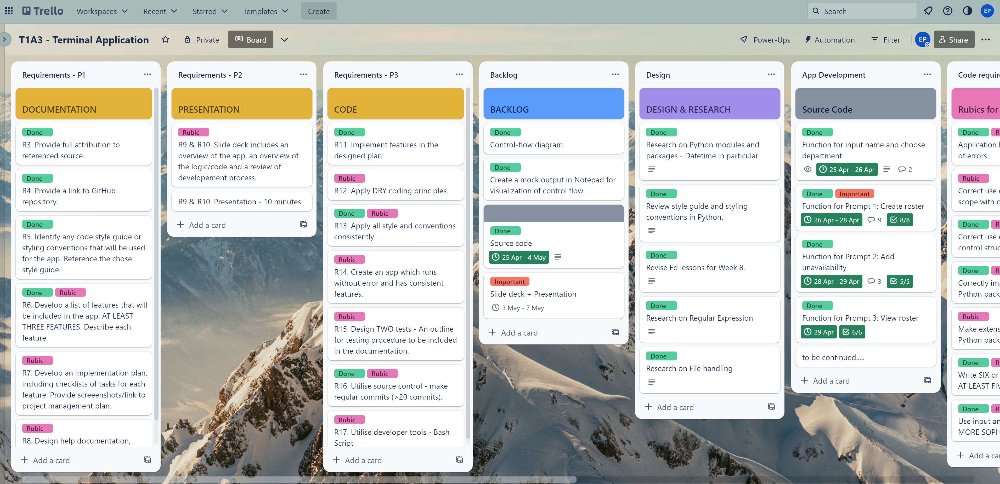
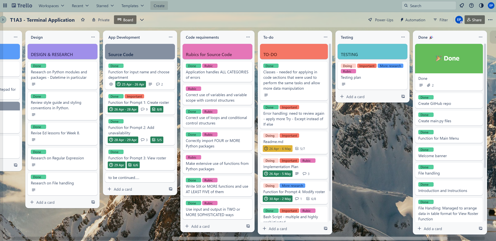

<br>

**Day 8**: More research on `pytest` and develop test cases using unit test. Also, do manual tests on main features for error detection. 

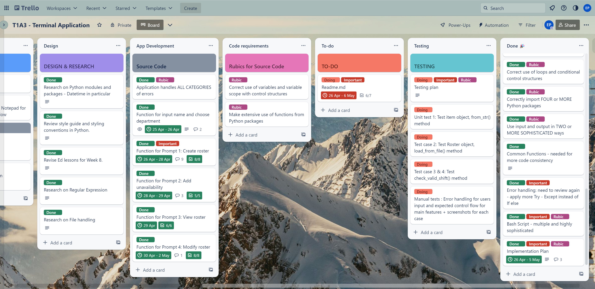

<br>

**Day 9 and 10**: Completed testing and finish off Readme file. Created slide deck and prepare presentation 

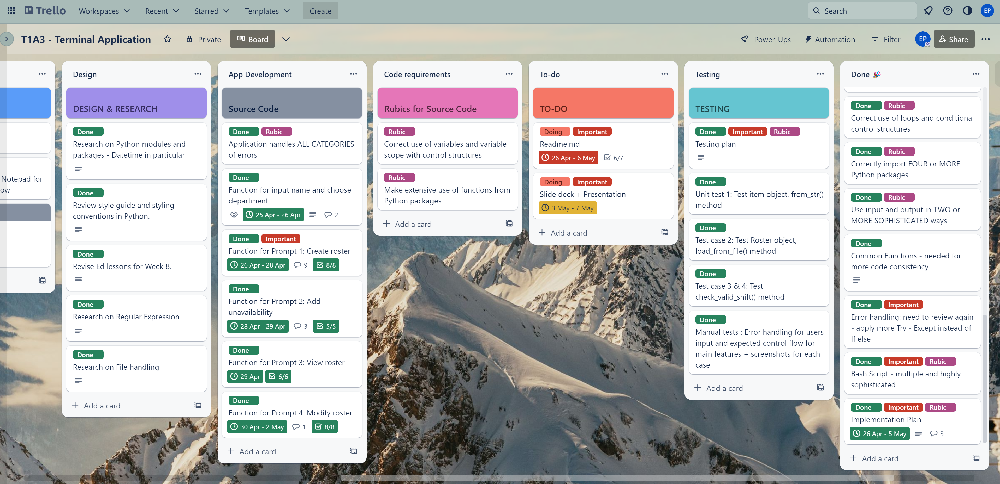

<br>

**Day 11**: Completed slide deck and presentation. Review project management plan and tick off tasks.


<br>

# Testing plan

## Manual testing

### Test case 1
`input_name()` function and `department_choice()` function: valid input contains letters only and function return a valid full name in the greeter.

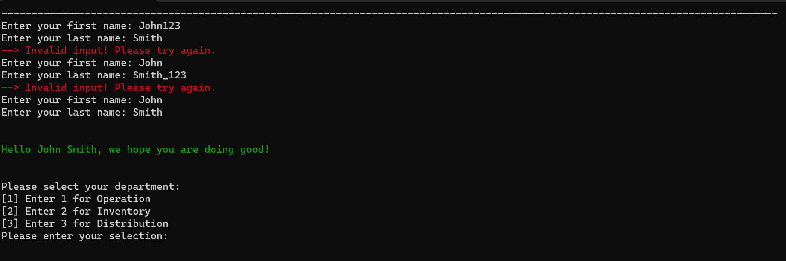
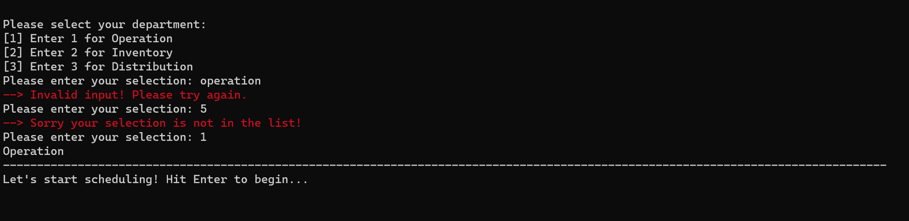

### Test case 2

- Valid input for `available_day` variable number from 1 to 7 inclusively. 
- Letter "Q" is also valid input for when users finish selecting.
- Input for two same days is not allowed. A reminder pops up if a day is already chosen
- If there are less than three days in the chosen list of days, a reminder pops up and uses are prompted to add more days. 
- If roster has already been created, users can only modify by using Prompt 4 in Home Menu.

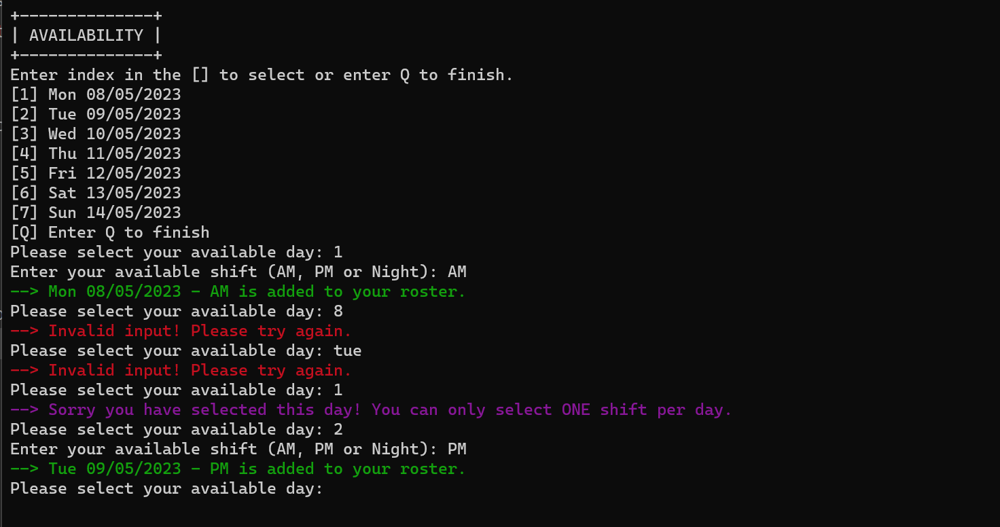
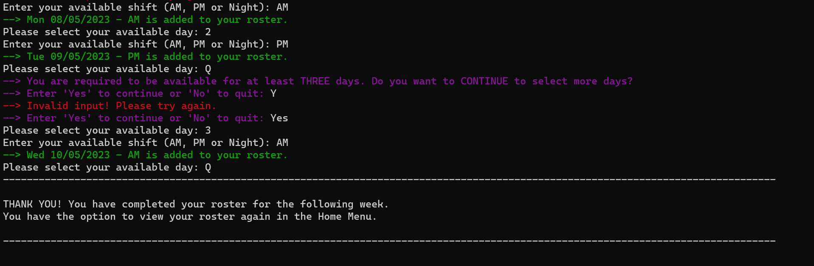
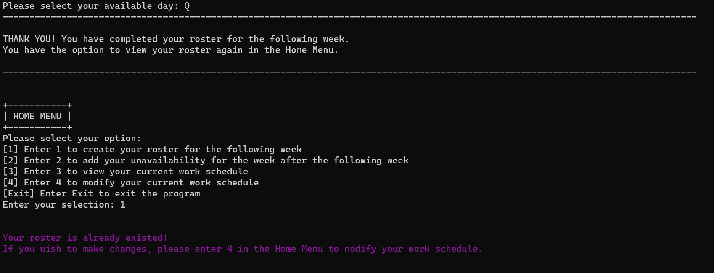

### Test case 3

- Input for two same unavailable days are not allowed, but multiple shifts selection is allowed. 
- Similarly, if unavailability has already been created, users can only modify by using Prompt 4 in Home Menu.

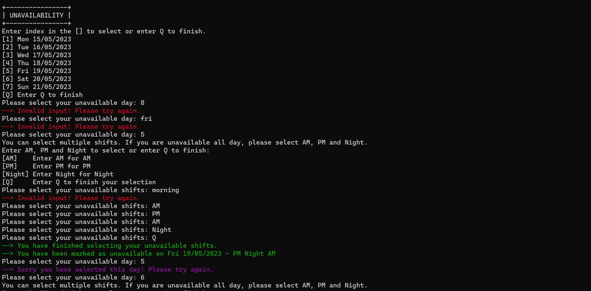
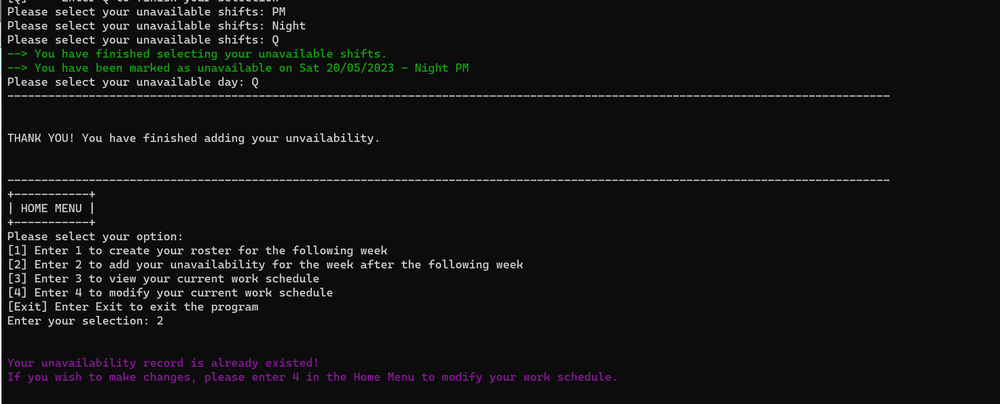

### Test case 4

- Final work schedule is displayed in table format as expected.
- Invalid input message pops up if users do not enter "Yes" or "No" to answer a yes-no prompt.

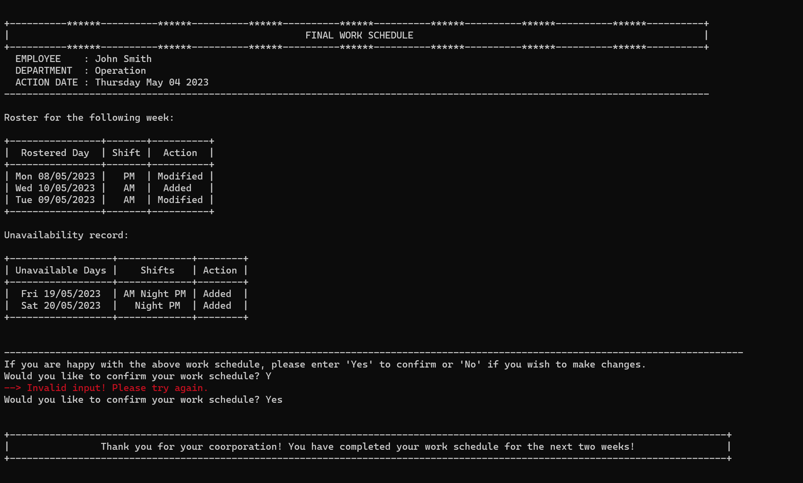

### Test case 5

- Data is up-to-date for displaying after each modification.
- Invalid input message pops up when users selection is not listed numbers.
- Reminder pops up again when rostered days are less than three after removing.
- If users choose to keep unavailabilituy record, final work schedule is displayed with confirmation request. 


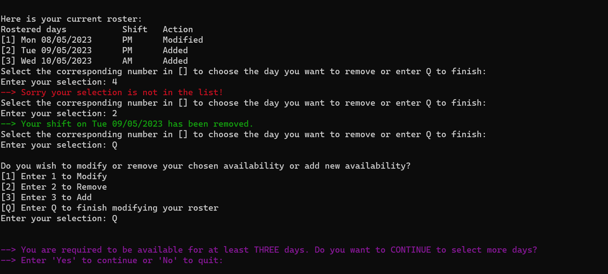
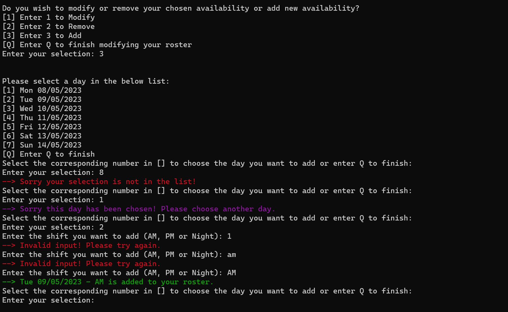
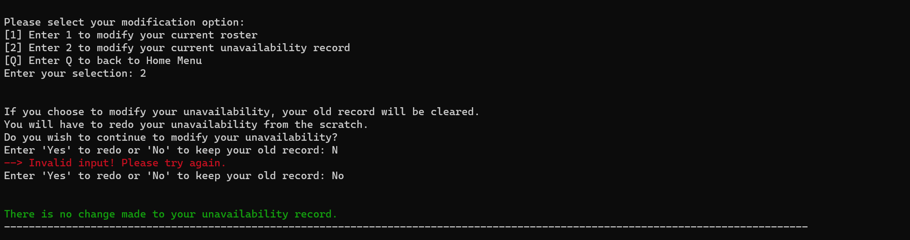

<br>

## Unit testing

Unit tests were carried to check if methods works are expected.

1. The below code is to test 

```
class TestItem (unittest.TestCase):
    def test_from_string(self):
        input = ["Fri 05/05/2023", "AM", "Added"]
        item = Item.from_str(input)
        self.assertEqual(str(item), "2023-05-05, AM, Added")  
```

2. The below code is to test if the `load_from_file()` method would load the correct number of item in the csv test file to the roster list as expected. 

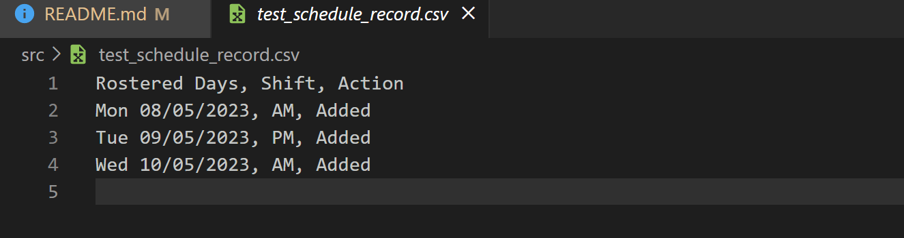

```
class TestRoster(unittest.TestCase):
    def test_load_from_file(self):
        roster = Roster()
        roster.load_from_file(file_name='test_schedule_record.csv')
        self.assertEqual(len(roster.roster), 3)        
```

3. The below code is to test if the `check_valid_shift()` method would take test input as True. 

```
class TestValidShift(unittest.TestCase):
    def test_check_valid_shift(self):
        test_shift_1 = "AM"
        test_shift_2 = "PM"
        test_shift_3 = "Night"
        self.assertTrue(check_valid_shift(test_shift_1))
        self.assertTrue(check_valid_shift(test_shift_2))
        self.assertTrue(check_valid_shift(test_shift_3))
```

4. The below code is to test if the `check_valid_shift()` method would take test input as False. 

```
class TestInvalidShift(unittest.TestCase):
    def test_check_valid_shift(self):
        test_shift_1 = "am"
        test_shift_2 = "!#$"
        test_shift_3 = "123"
        self.assertFalse(check_valid_shift(test_shift_1))
        self.assertFalse(check_valid_shift(test_shift_2))
        self.assertFalse(check_valid_shift(test_shift_3))
```

Test result is returned as expected:

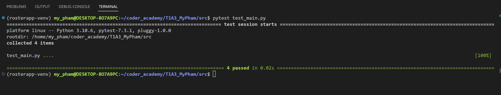