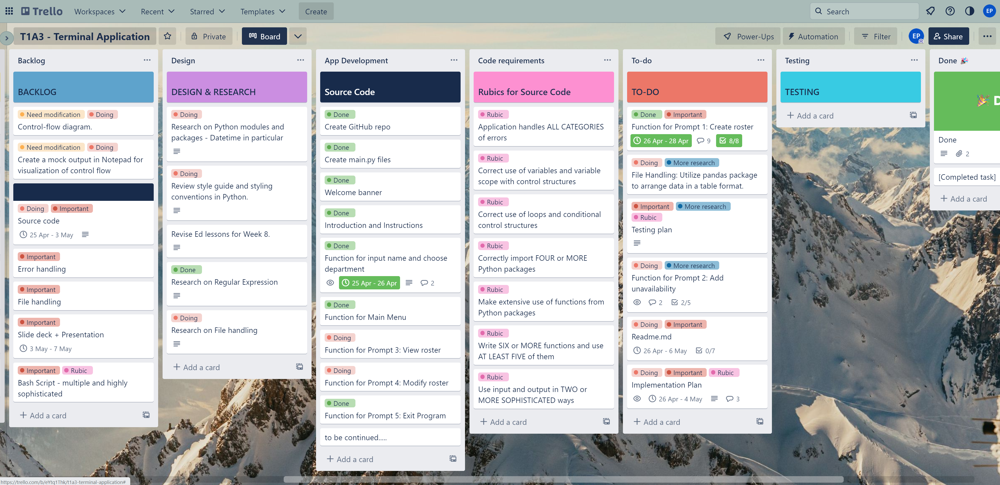
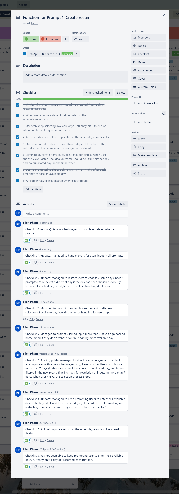

# **My Pham - T1A3 - Terminal Application**

# References

# Links
1. GitHub repository:
2. Presentation:
3. Project management plan:

# Code style guide and styling conventions

1. Rossum, G., Warsaw, B., Coghlan, N. (2001) PEP8 - Style Guide for Python Code [Styling Convention]. https://peps.python.org/pep-0008/

2. Goodger, D., Rossum, G. (2001) PEP 257 - Docstring Conventions [Styling Convention]. https://peps.python.org/pep-0257/

# Functionalities

## Description

NKG Corp. is a warehousing and distribution company. They have a large number of staff working across rotating shifts. **RosterBoard** is an application that help the company collect the availability and unavailability from rostered staff in order to prepare the workforce plan. The application also allows the staff to view their upcoming roster and flexibly schedule their work. 

## Main features
1. Users (the company staff) are asked to provide their name and their department before starting their work schedule. If all answers are valid, they get prompted to the home menu. 
2. The main menu has 5 prompts : Create Roster, Add Future Unavailability, View Roster, Modify Roster and Exit Program. 
3. In the Create Roster function, users are requested to create their roster for the following week based on a list of questions:
    - Choose their available days for the following week (Monday to Sunday).
    - Choose their available shifts for the chosen day.

    There are a few criterias when creating the roster. First, if the numbers of available day is less than THREE days, users will be prompted to choose 1 more available day or if they can not provide more days, they will be informed that they have no roster for the following week and the program ends here. Second, users can only choose ONE shift per available day. 

4. In the Add Future Unavailability function, users are requested to manually input their unavailability for ONE week after the following week according to a given format. Here they can input as many days or shifts as they wish to be their unavailability. If they have no unavailability, this will not get recorded. 

5. In the View Roster function, users' final work schedule is displayed, including staff name, department, the roster for the following week and unavailable days for the week after the following week. Users can confirm if the work schedule is correct or they can change their schedule, in which users will be prompted to the next function.

6. In the Modify Roster function, users can change their availability/unavailability if they change their mind, these modified information will get updated in their final roster and users can go back to the Main Menu to view the modified schedule.

## Control Flow Diagram

The below diagram illustrates how the flow of data and how users are prompted to action different tasks while accessing different functions of the app. 

(Diagram created using diagram.net.io)

 

# Implementation Plan

### Overall process

1. The project management plan is outlined with the kanban board format using Trello (screenshots and a link to Trello will be proved later on).

2. After the idea got approved by educator, a control flow diagram is created to visualize the flow of data in the app. The diagram reflects the overall logic of the app. The diagram was slightly modified along the way due to little compromised changes in the development process. 

3. A mock output is written using notepad to help visualizing the expected output when the app is run successfully and without errors. The mock output was created according to the designed control flow diagram. 

4. Start writing the source code. Define a range of Classes, Functions, Modules and Methods used for each listed feature. 

5. Errors were handled when each function's tasks were carried out during the development process.

6. Develop a testing plan, including manual tests and tests using Pytest.

7. Write scripts for app execution and develop help documentation. 

8. Reporting documentation (Readme file) was updated along the way whenever a task was finished.  

9. Summarise the project with slide deck and presentation 

 

### The implementation of each feature and task priority. 

The development steps were based on the control flow diagram. This is because the purpose of the app is to develop a range of prompts to get information from the users (the staff company) and build a work schedule that allows users to manipulate in their own way by using different app functions. 

There are only a few in-built criteria applied to users selection, which can be considered as company's policy. Because of this design, error handling is varied as users will be prompted to re-enter their inputs if the criteria are not met. 

Once the app has the data needed, it will process the collected data and display the data or modify the data upon users's request. 

Therefore, the implementation priority is listed as below:

1. Users registration
2. Create Roster Function
3. Add Future Unavailability Function
3. View Roster Function
4. Modify Roster Function

 

Below are checklists of tasks for each features and a short brief of work progress for each day during development process, followed by screenshots of project management platform (Trello).

**Users registration**

This section includes getting users' input for their name and their department. 

|Checklist |                                        Task                                        |  Timeline      | 
|----------|------------------------------------------------------------------------------------|----------------|
|1         |A prompt to request users' name                                                     |25 Apr - 26 Apr |
|2         |Error handling conducted: name input must be all letters.                           |25 Apr - 26 Apr |
|3         |A prompt to request users's selection for their department                          |25 Apr - 26 Apr |
|4         |Error handling conducted: selection must be in the given list                       |25 Apr - 26 Apr |
|5         |A greeter is displayed once users finish registering, followed by the Home Menu     |25 Apr - 26 Apr |
|6         |A Home Menu is displayed with 5 main prompts                                        |25 Apr - 26 Apr |

Day 1: Create project management plan, design control flow program, create mocking output, create GitHub repo and main.py file, complete welcome banner, introduction and instructions, push the first commit. 

**Create Roster Function**

This section includes getting users' input for their name and their department. 

|Checklist |                                        Task                                        |  Timeline      | 
|----------|------------------------------------------------------------------------------------|----------------|
|1         |Available days are automatically generated from a given roster release date         |26 Apr - 28 Apr |
|2         |When users choose a date, it get recorded in the schedule_record.csv                |26 Apr - 28 Apr |
|3         |User can keep selecting available days until they hit 8 to end                      |26 Apr - 28 Apr |
|4         |A chosen day can not be duplicated in the schedule_record.csv file                  |26 Apr - 28 Apr|
|5         |User is required to choose more than 3 days - if less than 3 they will be prompted to add more days or not getting rostered    |26 Apr - 28 Apr |
|6         |No duplication in schedule_record.csv file. Only ONE shift per day is valid         |26 Apr - 28 Apr |
|6         |User is prompted to choose shifts after each time they choose an available day.     |26 Apr - 28 Apr |
|6         |CSV file is deleted once exit program and recreated when program starts             |26 Apr - 28 Apr |

Day 2: Develop Create Roster Function for when Prompt 1 in Home Menu is selected, including formatting, data flow, file handling and error handling. 

 

Day 3: Complete Create Roster Function and update Readme file, start Add Future Unavailability Function. 

to be continued...
